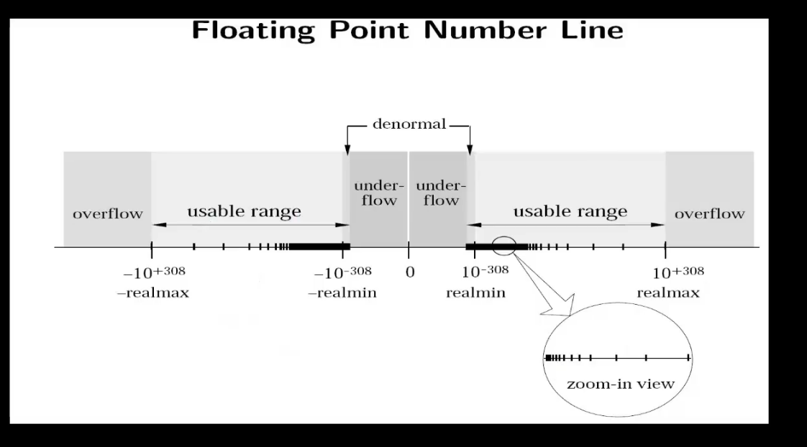

## Floating-point Numbers
- float y = 5.0F
  - %f
  - %f
- double x = 5.0
  - %lf
  - %f
- long double z = 5.0L
  - %Lf
  - %Lf

## Floating-point Arithmetic
- "FLOATING_POINT ARITHMETIC IS HARD."

